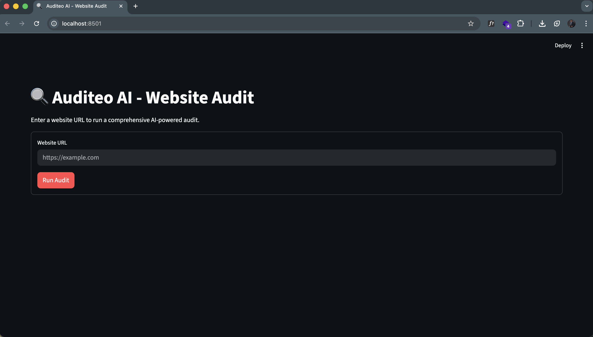
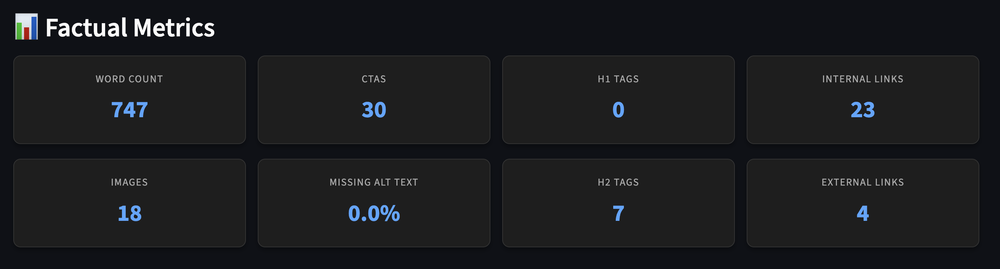
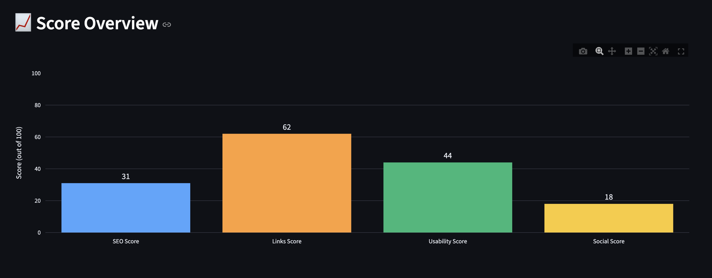

# Auditeo AI

**Autonomous Multi-Agent Website Audit Crew Flow**

Auditeo AI is a comprehensive, AI-powered website auditing tool that leverages a multi-agent architecture to analyze websites. It extracts factual metrics, evaluates technical SEO and UX, and provides prioritized, actionable recommendations to improve website performance and conversion rates.

---

## Table of Contents

- [Architecture](#architecture)
  - [Overview](#overview)
  - [AI Design Decisions](#ai-design-decisions)
  - [Trade-offs](#trade-offs)
  - [Future Planned Improvements](#future-planned-improvements)
- [API Documentation](#api-documentation)
- [Demo](#demo)
- [Installation](#installation)
- [Running the Application](#running-the-application)
- [Deployment](#deployment)
- [Collaboration](#collaboration)

---

## Architecture

### Overview

The Auditeo AI solution is divided into a frontend UI (Streamlit), a backend API (FastAPI), and an Audit Flow Engine powered by CrewAI. The architecture is designed to ground AI agents in factual data before generating insights and recommendations.


The audit process follows these core phases:

**User Input: Website URL**  
&darr;  
**Audit Flow (Crew AI Flow)**

1. **Scrape and Get Metrics:** Scrape the website, extract factual metrics, and set the initial state.
2. **Run InsightsCrew:**
   - **`analyst_agent`**: Analyzes the metrics and page content (powered by GPT 5.4).
   - *then*
   - **`reporter_agent`**: Formats the analysis into a structured report (powered by GPT 5.4 Mini).
3. **Run RecommendationCrew:**
   - **`strategy_lead`**: Formulates 3-5 high-impact, prioritized recommendations for the website (powered by GPT 5.4).
   - *then*
   - **`strategy_validator`**: Critically validates that every recommendation is 100% grounded in the factual metrics (powered by GPT 5.4 Mini).
4. **Wrap the Response:** Package the final deliverables along with the Execution Context (Token usage, execution time & status).
5. **Send to User:** Deliver the complete audit results to the frontend UI.

### AI Design Decisions

## Why Select [Crew AI](https://crewai.com/) and a Multi-Agentic Approach?


Using a multi-agent framework like CrewAI provides several key advantages over a single-prompt LLM approach:
- **Separation of Concerns:** Specialized agents focus on specific domains (e.g., analysis vs. formatting), leading to deeper, more accurate insights.
- **Self-Correction & Validation:** Multi-agent workflows allow for built-in quality control. One agent generates recommendations while another critically validates them against factual data to prevent hallucinations.
- **Model Optimization:** Complex reasoning tasks can be routed to more capable models (e.g., GPT 5.4), while formatting or validation tasks can use faster, cost-effective models (e.g., GPT 5.4 Mini).
- **Complex Task Orchestration:** Breaking down the audit process into sequential crews (Insights -> Recommendations) ensures context is passed systematically, mimicking a real-world agency workflow.

- **Multi-Agent Orchestration (CrewAI):** By separating concerns into distinct roles (e.g., SEO Auditor vs. Growth Strategist), the system ensures that each agent focuses on its specific domain, leading to higher quality and more specific outputs.
- **Data Grounding Layer:** Instead of letting LLMs hallucinate website details, the flow strictly enforces a "Scrape First" policy. The AI agents are fed factual metrics and cleaned HTML content as their primary context.
- **Validation Step:** The inclusion of a "Compliance Officer" agent acts as a quality control mechanism to filter out generic or hallucinated advice before it reaches the user.
- **Stateful Flow:** The `AuditFlowState` maintains the context (URL, metrics, content, insights, recommendations) across the entire execution pipeline, ensuring seamless data passing between crews.

### Trade-offs

- **Execution Latency vs. Insight Depth:** Running multiple LLM agents sequentially takes longer than a single prompt execution (often taking a few minutes). However, this trade-off is necessary to achieve deep, validated, and highly specific audit results.
- **Token Consumption:** Passing full page content and previous agent outputs down the pipeline increases token usage significantly. The system mitigates this slightly by cleaning the HTML (removing scripts/SVGs) before passing it to the LLMs.
- **Single Page vs. Full Domain:** Currently, the system audits a single URL deeply rather than crawling an entire domain shallowly, prioritizing depth of analysis over breadth.

### Future Planned Improvements

- **Parallel Agent Execution:** Implementing asynchronous execution for non-dependent agent tasks to reduce overall audit latency.
- **Multi-Page Site Crawling:** Expanding the scraper to follow internal links and audit core user journeys across multiple pages.
- **PDF Report Generation:** Adding functionality to export the final audit report and recommendations as a branded PDF for client deliverables.
- **Real-World Data Integration:** Integrating with Google Search Console or Google Analytics APIs to ground the AI in actual traffic and performance data.
- **Streaming UI Updates:** Implementing WebSockets or Server-Sent Events (SSE) to stream agent thoughts and progress to the UI in real-time.

---

## API Documentation

For detailed API documentation, please refer to the [API Wiki](./wiki/API.md).

---

## Demo





Please refer to the [Example Wiki](./wiki/Demo.md) for complete UI.

---

## Installation

This project uses `uv` for fast dependency management and packaging.

1. **Clone the repository:**
   ```bash
   git clone https://github.com/isweerasingha/Auditeo-AI.git
   cd Auditeo-AI
   ```

2. **Install dependencies:**
   Make sure you have `uv` installed. Then run:
   ```bash
   uv sync
   ```
   *Alternatively, you can use standard pip:*
   ```bash
   pip install -e .
   ```

3. **Environment Variables:**
   Create a `.env` file in the root directory and add your necessary API keys (e.g., OpenAI API key for CrewAI):
   ```env
   OPENAI_API_KEY=your_openai_api_key_here
   ```

   ```env
   ENV=development
   ```

---

## Running the Application

The application consists of two parts: the FastAPI backend and the Streamlit frontend. You will need to run both simultaneously in separate terminal windows.

### 1. Run the Backend API (FastAPI)

Start the API server (or with ASGI server targeting via `uvicorn run`):

```bash
python -m auditeo_ai.main
```
The API will be available at `http://localhost:8000`.

### 2. Run the Frontend UI (Streamlit)

In a new terminal window, start the Streamlit app:

```bash
uv run streamlit run streamlit_app.py
```
The UI will automatically open in your browser at `http://localhost:8501`.

---

## Deployment

### Docker (Recommended)
You can containerize both the API and the UI using Docker. 
1. Create a `Dockerfile` for the FastAPI backend and another for the Streamlit frontend.
2. Use `docker-compose.yml` to orchestrate both services, ensuring the UI can communicate with the API container.

### Cloud Platforms
- **Backend API:** Can be deployed to services like AWS ECS, Google Cloud Run, or Render.
- **Frontend UI:** Can be easily deployed to Streamlit Community Cloud, Vercel, or alongside the backend on container hosting platforms.

---

## Collaboration

We welcome contributions! If you'd like to help improve Auditeo AI:

1. Fork the repository.
2. Create a new feature branch (`git checkout -b feature/amazing-feature`).
3. Make your changes and ensure code quality using the included dev tools:
   ```bash
   uv run ruff check .
   uv run ruff format .
   ```
4. Commit your changes (`git commit -m 'Add some amazing feature'`).
5. Push to the branch (`git push origin feature/amazing-feature`).
6. Open a Pull Request.

Please ensure you open an issue first to discuss significant architectural changes before submitting a PR.