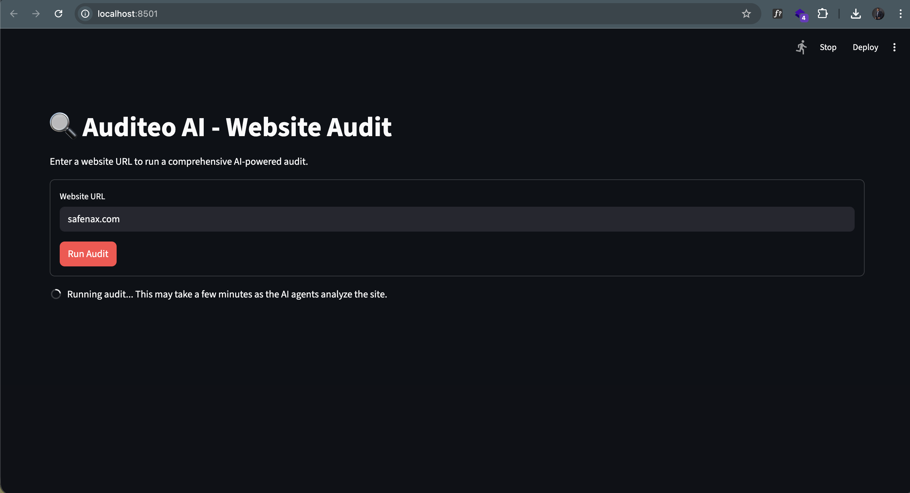
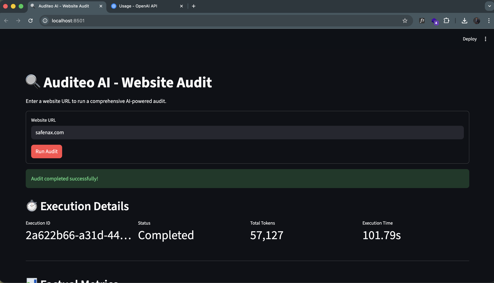
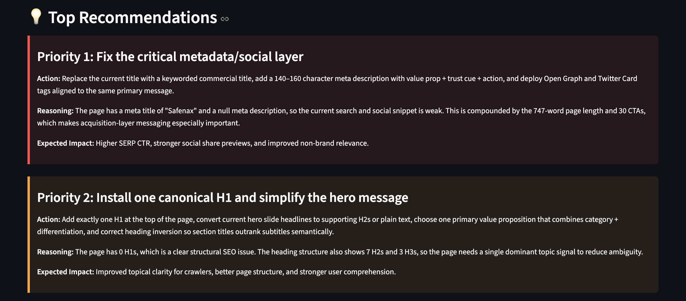
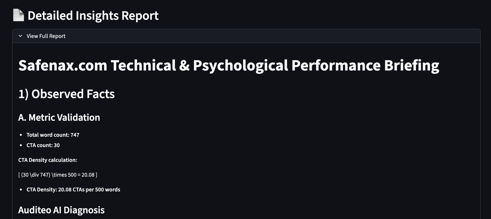

# Auditeo AI - UI Examples

This document showcases the user interface of Auditeo AI through a series of example screens.

## Screen 1 : Start, enter the url

## Screen 2 : Processing

## Screen 3 : Execution Details (Token Usage, Execution Time, etc)

## Screen 4 : Factual Metrics

## Screen 5 : Score Overview

## Screen 6 : Top Recommendations

## Screen 7 : Detailed Insight report

